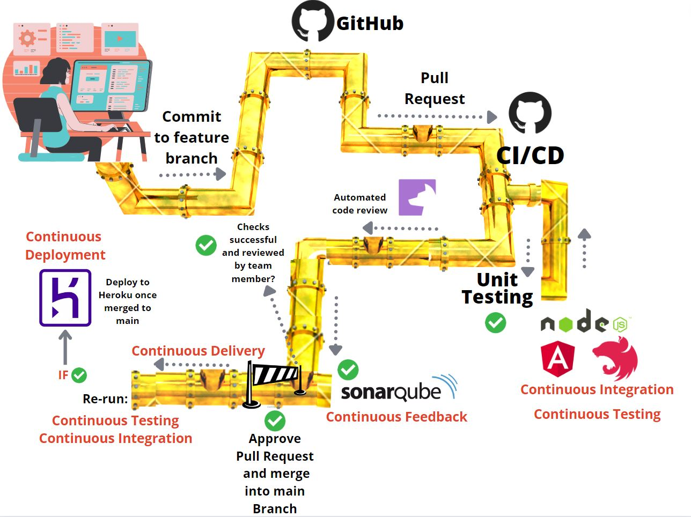

# KMS-MyCargonaut Projekt SS22

## Mitglieder:
- Vladislav Bova
- Jonas Schuck
- Artem Grishin
- Felix Karow
- Samir Faycal Tahar M'Sallem

## Ordnerstruktur:

- client: Frontend (Angular)
- server: Backend (NestJS)
- doku: Dokumentation (Mockups, Wireframes, Notizen, Workflow)

## Vorgehen

Wir haben uns zunächst zusammengesetzt und einen Technologiestack definiert. Im Anschluss haben wir unsere Sprintsziele definiert und diese dann in konkrete Issues geschrieben um diese abzuarbeiten. Wir haben begonnen Mockups und Wireframes zu erstellen, ein Manifest zu schreiben, wie unser Workflow (in Bezug auf Commits, Branching und Merge-Strategie) abläuft. Begonnen wurde in der Implementierung mit der Infrastruktur (Pipeline, SonarQube, Heroku, MongoDB) und mit dem Erstellen von zwei Projekten mit den Frameworks für FE und BE.

Im Anschluss wurde dann die Pipeline implementiert und mit den zwei Demo Projekten getestet. Nachdem dann viele Features implementiert wurden musste die Pipeline noch angepasst werden (Dependencies, Routing, CORS). Das solide Konstrukt stand aber bereits nach dem ersten Sprint.

Workflow: https://github.com/samirmsallem/KMS-MyCargonaut/wiki/Workflow

## Features

Pipeline die kompletten DevOps Zyklus unterstützt und vollautomatisch alle Bereiche abdeckt, wir sind in der Lage unsere Anwendung zu testen, zu bauen und zu deployen ohne dass wir noch etwas dafür tun müssen. Pull Requests geben Auskunft über Codequalität und Testergebnisse. - cool wären noch Testchannels gewesen um die neuen Features innerhalb einer Sandbox zu deployen und gleich zu testen, das gibt es leider aber nur bei Firebase und Firebase Functions kostet nun mal Geld.. generell wäre das aber möglich gewesen.

Anwendung:
- Registrierung / Login
- Abgesicherte Routen mit Auth Guard
- Auflisten des Profils
- Bearbeiten des Profils
- Einstellen von Angeboten und Gesuchen
- Auflisten von Angeboten und Gesuchen (eigene werden ausgeschlossen)
- Tätigen von Transaktionen

## CI / CD Pipeline:

1. Unit Testing 
2. Static Code Analysis: SonarQube (PR + main-Branch) https://scm.thm.de/sonar/dashboard?id=kms-mycargonaut
3. Deployment Heroku (main-Branch only) https://mycargonaut-kms.herokuapp.com/
4. Hound (Code review on PR)

